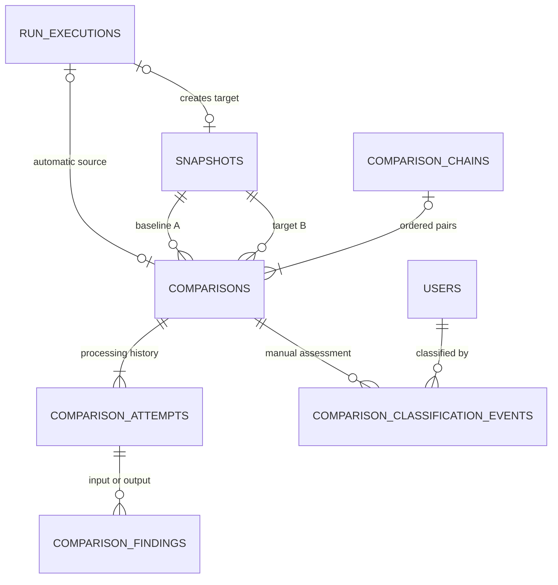

# AnD Database — Group 6 Comparison Engine và Group 7 Result/Classification

**Phiên bản:** 0.3 · **Ngày:** 2026-09-24 · **Trạng thái:** Reviewed logical design; cần đối chiếu repo trước Physical Design  
**Chuẩn áp dụng:** `Database_Standard_v2.0(4).docx` (Database Design Standard v2.0)  
**Nguồn requirement:** REQ-CMP-001…018, REQ-ENV-004, REQ-OUT-002. CMP-013…018 là BA Proposed; các chi tiết đã được BA duyệt, còn Client Confirmation theo quy trình dự án. REQ-CMP-002 có Priority Should.

## 1. Phạm vi và kết luận thiết kế

Mô hình cần lưu ba lớp dữ liệu khác nhau:

1. **Run/Execution và Snapshot hiện hữu:** Execution chốt baseline trước khi gọi API; Snapshot giữ actual input/output và metadata lịch sử. Khi thiếu baseline hoặc không tạo được target, lý do availability nằm ở Execution, **không tạo Comparison một Snapshot**.
2. **Comparison và attempt:** Khi có hai Snapshot ID cụ thể, Comparison giữ danh tính cặp, chiều A→B và nguồn tạo; mỗi lần xử lý/retry là một attempt có status, gate, reason, input outcome, Result nếu hoàn tất và dấu vết rule/policy.
3. **Finding và classification:** Finding mô tả output difference hoặc chẩn đoán input mismatch an toàn. Expected/Unexpected là sự kiện đánh giá thủ công của người dùng, tách khỏi Result của engine.

Logical model đề xuất **5 bảng mới**: `comparison_chains`, `comparisons`, `comparison_attempts`, `comparison_findings`, `comparison_classification_events`; và **mở rộng `run_executions` hiện hữu** để giữ baseline/availability. Đây là đề xuất entity/column, không phải xác nhận rằng repo hiện đã có các tên bảng/cột này. Trước migration phải đối chiếu schema Prisma, migration Group 5 và API hiện hữu.

### 1.1 Quyết định đã có và điểm còn mở

| Nội dung | Cơ sở | Trạng thái DB |
| --- | --- | --- |
| Result chỉ SAME/DIFFERENT sau cặp hợp lệ, input compatible và output so đủ | CMP-001/005/006/007 | CONFIRMED ở cấp BA |
| Baseline ID chốt trước Execution; không tự chọn lại | CMP-003/013 | CONFIRMED ở cấp BA; vị trí cột là DESIGN PROPOSAL |
| Không đủ hai Snapshot không sinh Comparison | CMP-013/014/016 | CONFIRMED ở cấp BA |
| Manual/chain giữ cặp/chiều và lịch sử riêng; retry không ghi đè completion | CMP-004/014/016 | CONFIRMED ở cấp BA; cấu trúc 5 bảng là DESIGN PROPOSAL |
| Raw bytes/headers/payload đầy đủ nằm ở Snapshot, không copy vào finding | CMP-006/007/017/018; DB-STD-02/06 | CONFIRMED nguyên tắc, cơ chế truy xuất Snapshot cần review |
| Classification chỉ cho DIFFERENT hoàn tất, có lịch sử actor/time | CMP-002 | CONFIRMED ở cấp BA; quyền role cụ thể thuộc USR/AUTH |
| Retention của Comparison/attempt/finding/classification | CMP-016/002 yêu cầu lịch sử; Standard §19 | AnD chọn không xóa tự động và RESTRICT; thời hạn/chính sách archive do data owner quyết định |
| Status code, VARCHAR, transaction và index | CMP-014/016; Standard §§12/15/27 | AnD quyết định ở §§4–6; tên FK thực đối chiếu schema |

## 2. Entity boundary, relationship và ERD logical

**Nguồn sự thật:** Snapshot nắm Project/API/Environment/auth context lịch sử, actual request/response, latency và API/DB Version. Theo RS-CMP-016-01, mỗi Comparison **lưu trực tiếp** Project ID, API ID, Environment ID cùng A/B; các ID này lấy từ Snapshot tại lúc tạo và phải được kiểm tra khớp cả hai phía, không nhận làm dữ liệu authoritative từ frontend. Auth context được kiểm tra bằng giá trị lịch sử của Snapshot. Latency, version và payload vẫn lấy từ Snapshot.

**No-pair boundary:** Khi Execution không có baseline hoặc target, ghi availability trên Execution; không tạo Comparison. Yêu cầu thủ công BASELINE_LATEST không tìm được latest/baseline hoặc baseline đã invalidated thì API trả availability cho chính request đó, **không ghi vào Execution**, không tạo Comparison/attempt và không tự chọn mốc thay. Các code `NO_LATEST_SNAPSHOT`/`BASELINE_INVALIDATED` trong API manual không phải giá trị của `run_executions.comparison_availability_reason_code`.

| Quan hệ | Cardinality/optionality và ý nghĩa |
| --- | --- |
| Execution → baseline Snapshot | Mỗi Execution có 0..1 baseline ID đã chốt; một Snapshot có thể là baseline của 0..N Execution. `NULL` nghĩa không có mốc, **không phải ID giả**. |
| Execution → automatic Comparison | Mỗi Execution có 0..1 Comparison tự động cho đúng baseline→target đã chốt; một Comparison có 0..1 source Execution (chỉ AUTO). Manual/chain có identity khác và không bị unique(A,B) toàn cục. |
| Execution → target Snapshot | Theo luồng Group 5, một Execution tạo 0..1 Snapshot đủ điều kiện; xác nhận cardinality thực trong schema hiện hữu trước FK/migration. |
| Snapshot → Comparison A/B | Mỗi Comparison có đúng 1 A và 1 B, A≠B; một Snapshot có thể tham gia 0..N Comparison ở mỗi vai trò. |
| Chain → Comparison | Chỉ lưu yêu cầu chain hợp lệ với ít nhất 2 Snapshot: chain có 1..N cặp liền kề; mỗi cặp có 0..1 chain. Yêu cầu không hợp lệ trả lỗi validation, không tạo chain. Quyết định AnD. |
| Comparison → Attempt | Comparison được tạo cùng attempt đầu trong một transaction: 1..N attempt. Quyết định AnD theo CMP-016. |
| Attempt → Finding | 0..N findings. Input mismatch có input findings riêng; SAME hoàn tất không có output findings; DIFFERENT hoàn tất có ≥1 output finding. |
| Comparison → Classification event | 0..N event theo thời gian, chỉ với DIFFERENT hoàn tất; event mới nhất là classification hiện tại. |

`projects`, `api_configurations`, `environments`, `users`, `run_executions`, `snapshots` và payload/invalidation tables là **entity hiện hữu tham chiếu**, tên vật lý phải đối chiếu repo. Không tạo bảng copy cho latency/version, header/body, status danh mục hay policy nếu chưa có requirement quản trị độc lập. Rule/policy áp dụng được đóng băng trong attempt bằng một immutable manifest (đề xuất); policy master nếu dự án đã có phải dùng FK/version đúng nguồn.

## 3. Table Dictionary

| Table | Purpose / Owner / Type | Lifecycle, retention, sensitivity | Volume / access pattern | Basis / status |
| --- | --- | --- | --- | --- |
| `run_executions` **existing extension** | Giữ baseline ID và availability trước/sau Run; RUN/CMP; entity | Chỉ cập nhật field theo lifecycle Execution; không xóa history khi còn được tham chiếu; internal | High; đọc theo Run/Execution, chọn baseline trước dispatch | CMP-003/013/014/016; extension AnD |
| `comparison_chains` | Identity yêu cầu so chuỗi và danh sách cặp đã chốt qua thứ tự; CMP; entity | Create, processing/history; không xóa tự động; internal | Low/medium; Project và thời gian, lấy cặp theo ordinal | CMP-004/016; AnD |
| `comparisons` | Identity một cặp A→B, source/mode, Execution/chain liên quan; CMP; entity | Create once, giữ lịch sử; không sửa A/B/source; không xóa tự động; internal | Medium/high; list theo Project/API/Snapshot/Execution | CMP-001/004/013/016; AnD |
| `comparison_attempts` | Mỗi lần xử lý/retry, gate/status/reason/input outcome/Result/rule manifest; CMP; history | Append attempt, terminal immutable; không xóa tự động; internal | Medium/high; latest và history theo Comparison | CMP-001/006/014/016/017; AnD |
| `comparison_findings` | Vị trí/loại khác biệt output hoặc chẩn đoán input; CMP; detail/history | Ghi cùng attempt, chỉ publish khi gate tương ứng hoàn tất; không xóa tự động; có thể sensitive metadata | High/variable; page theo attempt, phase, ordinal | CMP-006/015/016/018; AnD |
| `comparison_classification_events` | Lịch sử append-only Expected/Unexpected và note tùy chọn; CMP/OUT; audit/change history | Insert mỗi cập nhật, không sửa/xóa event; không xóa tự động; note có thể sensitive | Low/medium; latest/history theo Comparison | CMP-002; AnD |

**Delete behavior AnD:** `RESTRICT` cho Snapshot/Comparison/Attempt/User còn lịch sử được tham chiếu; không `CASCADE` từ Project/Run/Snapshot làm mất bằng chứng hoặc actor. Nếu domain hiện dùng soft delete/invalidation, giữ FK và kiểm tra quyền hiện hành. Các bảng business entity có `note TEXT NULL` theo Standard §8: `comparison_chains` và `comparisons` có note tùy chọn; attempt/findings là history/audit có rationale ngoại lệ không cần note. Classification note là nội dung nghiệp vụ tùy chọn đã được CMP-002 duyệt. Chính sách xóa/anonymize theo tổ chức vẫn cần xác nhận trước vận hành.

## 4. Column Dictionary — logical với physical guidance

`UUID`, `TIMESTAMP UTC`, `VARCHAR(n)`, `TEXT` và `JSON logical` theo Standard §12. PostgreSQL `uuid`, `timestamptz`, `jsonb` bên dưới là **physical guidance**, chưa là DDL. Độ dài `n` của status/code cần rà domain thực trước freeze. `—` nghĩa không có SQL default; initial value do flow gán. `NN` = NOT NULL, `N` = nullable.

### 4.1 Extension của `run_executions` (chỉ field mới)

| Column | Type, null, key/default | Meaning, constraint, source/status |
| --- | --- | --- |
| `baseline_snapshot_id` | UUID N, FK `snapshots.snapshot_id`, — | Snapshot được chốt ngay trước Execution; NULL nếu không có mốc. CMP-003/013/016 CONFIRMED meaning; vị trí field PROPOSAL. |
| `baseline_selected_at` | TIMESTAMP UTC N, — | Thời điểm chọn mốc, cần chứng minh “trước dispatch”; có thể NULL nếu không chọn được mốc. CMP-003 DESIGN PROPOSAL vì event timestamp có thể đã nằm ở log hiện hữu. |
| `comparison_availability_reason_code` | VARCHAR(32) N, — | `NO_BASELINE` hoặc `NO_NEW_SNAPSHOT` ở Execution, không là Comparison Result. Nếu cả hai thiếu, reason chính theo gate đầu tiên là NO_BASELINE, Run/Snapshot outcome vẫn ghi thiếu target riêng. CMP-014/016; cách lưu field là AnD. |

Không lưu target Snapshot ID thứ hai nếu quan hệ `snapshots.run_execution_id` hiện hữu đã bảo đảm 0..1 và truy xuất ổn định. Nếu không, chọn FK/unique sau khi kiểm tra schema. Baseline FK dù Snapshot về sau invalidated vẫn giữ ID.

### 4.2 `comparison_chains`

| Column | Type, null, key/default | Meaning, constraint, source/status |
| --- | --- | --- |
| `comparison_chain_id` | UUID NN, PK, — | Identity của yêu cầu chain. CMP-004/016 PROPOSAL. |
| `project_id` | UUID NN, FK projects, — | Project scope của yêu cầu; các cặp phải cùng Project. CMP-004. |
| `api_id` | UUID NN, FK API entity, — | API scope của chuỗi, lấy từ hai điểm đầu/cuối. CMP-004-10. |
| `environment_id` | UUID NN, FK environments, — | Environment scope lịch sử của chuỗi. CMP-004-10/ENV-004. |
| `requested_by` | UUID NN, FK users, — | Người yêu cầu so chuỗi; chain là thao tác thủ công. CMP-004/016. |
| `created_at` | TIMESTAMP UTC NN, DB default candidate | Thời điểm chốt chuỗi. CMP-004/Standard CONFIRMED meaning. |
| `note` | TEXT N, — | Field chuẩn cho entity, không bắt buộc flow. Standard §8 DESIGN PROPOSAL. |

Danh sách Snapshot và thứ tự cặp được chốt bằng các `comparisons` có `comparison_chain_id` và `pair_ordinal`; không lưu thêm JSON array trùng lặp. Trường trạng thái toàn chuỗi không có Result chung; nếu UI cần tiến độ, có thể tính từ status từng cặp. Cột progress cache chỉ là proposal hiệu năng sau đo workload.

### 4.3 `comparisons`

| Column | Type, null, key/default | Meaning, constraint, source/status |
| --- | --- | --- |
| `comparison_id` | UUID NN, PK, — | Identity bất biến của phép so/cặp. CMP-001/016 CONFIRMED meaning. |
| `project_id` | UUID NN, FK projects, — | Project ID lịch sử của Snapshot A; chỉ là scope chung nếu B trùng ID sau gate. RS-CMP-016-01; không lấy từ frontend. |
| `api_id` | UUID NN, FK API entity, — | API ID lịch sử của Snapshot A; B được kiểm tra riêng, mismatch → BLOCKED. RS-CMP-016-01/CMP-005. |
| `environment_id` | UUID NN, FK environments, — | Environment ID lịch sử của Snapshot A; B khác ID → BLOCKED/ENVIRONMENT_MISMATCH. RS-CMP-016-01/ENV-004. |
| `baseline_snapshot_id` | UUID NN, FK snapshots, — | Snapshot A. CMP-001/004/016 CONFIRMED. |
| `target_snapshot_id` | UUID NN, FK snapshots, — | Snapshot B; CHECK A≠B. CMP-004/005/016 CONFIRMED. |
| `source_kind` | VARCHAR(32) NN, — | Domain AnD: `AUTO_EXECUTION`, `MANUAL_PAIR`, `BASELINE_LATEST`, `CHAIN_PAIR`. Baseline-latest là subtype manual; không gộp automatic. CMP-004/013/016. |
| `source_execution_id` | UUID N, FK run_executions, — | Bắt buộc và duy nhất cho AUTO trong logical model; NULL cho manual/chain. Cùng Execution không được tạo nhiều Comparison tự động kể cả queue giao lặp. CMP-013/016. |
| `comparison_chain_id` | UUID N, FK comparison_chains, — | Có giá trị cho CHAIN_PAIR; NULL cho mode khác. CMP-004/016. |
| `pair_ordinal` | INTEGER N, — | Thứ tự cặp trong chain, bắt đầu từ 1; unique(chain_id, ordinal). CMP-004/016. |
| `requested_by` | UUID N, FK users, — | Actor của manual/baseline-latest; AUTO có system source, NULL. CMP-004/016 DESIGN PROPOSAL. |
| `created_at` | TIMESTAMP UTC NN, DB default candidate | Thời điểm yêu cầu cặp được chốt; không thay execution_completed_at. CMP-004/016. |
| `note` | TEXT N, — | Field chuẩn entity. Standard §8 DESIGN PROPOSAL; không dùng thay reason. |

Project/API/Environment của Comparison được ghi trực tiếp theo CMP-016. **Chúng mô tả scope A**, lấy từ Snapshot A và chỉ được coi là scope chung của cặp sau khi gate CMP-005 xác nhận B trùng cả ba ID cùng auth context. Cặp đã chỉ định nhưng không đạt gate vẫn giữ A/B cùng status BLOCKED/reason theo CMP-014/016; vì vậy **không đặt DB CHECK bắt A/B cùng scope để ngăn insert**. Backend xác minh quyền với cả A/B trước khi tạo hoặc trả reason; thiếu quyền từ chối ở AUTH, không persist reason của Comparison. Field của B nằm ở Snapshot lịch sử, không bị ghi đè bằng field của A.

### 4.4 `comparison_attempts`

| Column | Type, null, key/default | Meaning, constraint, source/status |
| --- | --- | --- |
| `comparison_attempt_id` | UUID NN, PK, — | Identity một lần xử lý/retry. CMP-014/016. |
| `comparison_id` | UUID NN, FK comparisons, — | Cặp đang được thử; `UNIQUE(comparison_id, attempt_number)`. CMP-016. |
| `attempt_number` | INTEGER NN, — | Số thứ tự tăng trong một Comparison, >0. CMP-016 DESIGN PROPOSAL. |
| `processing_status` | VARCHAR(20) NN, initial do flow | Domain AnD: QUEUED/RUNNING/BLOCKED/FAILED/COMPLETED. CMP-014/016. |
| `stopped_at_gate` | VARCHAR(n) N, — | Gate eligibility/input/output/persistence khi dừng; NULL nếu chưa dừng. CMP-014/016. |
| `reason_code` | VARCHAR(40) N, — | Một reason chính theo bước dừng đầu tiên, domain ở §5. CMP-014/016. |
| `reason_detail_safe` | TEXT N, — | Chi tiết đã loại secret, chỉ khi cần; không chứa raw payload/token. CMP-014/AUTH. |
| `input_check_outcome` | VARCHAR(n) N, — | COMPATIBLE/MISMATCH nếu gate input kết thúc; NULL trước gate hoặc không đánh giá được. CMP-006/014. |
| `comparison_result` | VARCHAR(n) N, — | SAME/DIFFERENT chỉ khi COMPLETED; NULL ở mọi trạng thái khác. CMP-001/014/016 CONFIRMED. |
| `applied_rule_manifest` | JSON logical N, — | Snapshot immutable của rule/version/policy/exclusion/representation boundary dùng ở attempt. N trước khi rule được chọn; NN trước completion. CMP-006/007/008/016/017/018 PROPOSAL JSON. |
| `started_at` | TIMESTAMP UTC N, — | Thời điểm engine bắt đầu. CMP-013/016 DESIGN PROPOSAL. |
| `ended_at` | TIMESTAMP UTC N, — | Thời điểm attempt dừng vì hoàn tất, bị chặn hoặc lỗi; NULL khi còn chờ/chạy. CMP-016 DESIGN PROPOSAL. |
| `created_at` | TIMESTAMP UTC NN, DB default candidate | Thời điểm attempt được ghi. Standard §8; CMP-016. |

**Invariant:** `COMPLETED ⇔ comparison_result IN (SAME, DIFFERENT)`. COMPLETED/SAME cần 0 output findings; COMPLETED/DIFFERENT cần ≥1 output finding, cùng transaction publish. BLOCKED vì input mismatch có `input_check_outcome=MISMATCH`, Result NULL và không có output finding. Lỗi engine sau một phần output có Result NULL; finding tạm không được public như Detail hoàn chỉnh. Với retry, không sửa attempt terminal cũ. Một Comparison chỉ có tối đa một attempt COMPLETED có Result có hiệu lực; sau completion, yêu cầu so lại tạo Comparison/request mới, không thay Result cũ. Summary lấy completed attempt nếu có; nếu chưa có completion thì lấy attempt mới nhất theo attempt_number để hiển thị status/reason. `applied_rule_manifest` chỉ lưu metadata/quy tắc, không lưu credential/raw body; nguồn policy hiện hữu cần đối chiếu.

### 4.5 `comparison_findings`

| Column | Type, null, key/default | Meaning, constraint, source/status |
| --- | --- | --- |
| `comparison_finding_id` | UUID NN, PK, — | Identity của một finding trong attempt. CMP-015/016. |
| `comparison_attempt_id` | UUID NN, FK attempts, — | Attempt tạo finding. CMP-015/016. |
| `phase` | VARCHAR(n) NN, — | INPUT hoặc OUTPUT; INPUT là chẩn đoán mismatch, OUTPUT là Difference Detail. CMP-006/015. |
| `component` | VARCHAR(32) NN, — | Domain AnD: METHOD/URL/REQUEST_HEADER/REQUEST_BODY hoặc HTTP_STATUS/RESPONSE_HEADER/RESPONSE_BODY; dùng theo phase. CMP-006/007/015. |
| `finding_ordinal` | INTEGER NN, — | Thứ tự ổn định phân trang, unique(attempt_id, phase, ordinal). CMP-015 DESIGN PROPOSAL. |
| `difference_kind` | VARCHAR(32) NN, — | Domain AnD: PRESENCE, TYPE, VALUE, ORDER, LENGTH, RAW_BYTES; `value_kind` tách absent/null/empty. CMP-008/009/010/015/018. |
| `location_path` | TEXT N, — | JSON path hoặc tên header khi xác định được; không tạo path JSON giả cho raw. CMP-015/017. |
| `a_byte_offset`, `b_byte_offset` | BIGINT N, — | Vị trí bắt đầu vùng raw ở từng Snapshot; ≥0 khi có. CMP-015/018. |
| `a_byte_length`, `b_byte_length` | BIGINT N, — | Chiều dài vùng khác; ≥0 khi có. CMP-015/018. |
| `a_value_kind`, `b_value_kind` | VARCHAR(n) N, — | Phân biệt ABSENT, NULL, EMPTY_STRING, EMPTY_ARRAY, NUMBER, STRING… khi có ý nghĩa; không suy missing từ dữ liệu hỏng. CMP-009/010/015. |
| `rule_code` | VARCHAR(n) NN, — | Rule/manifest entry dẫn đến finding, không là nguyên nhân nghiệp vụ. CMP-015/016. |
| `safe_summary` | TEXT N, — | Mô tả đã redacted, không lưu raw secret; Detail lấy source Snapshot qua backend có quyền. CMP-015/AUTH. |
| `created_at` | TIMESTAMP UTC NN, DB default candidate | Thời điểm ghi finding. Standard §8. |

Không lưu nguyên `value_a`/`value_b` raw trong findings vì sẽ nhân đôi header Authorization, cookie, file hoặc PII; Snapshot là nguồn. Offset/path chỉ đủ để tái hiện Detail nếu Snapshot immutable, còn truy xuất được và có representation đầy đủ; kiểm chứng ở DB-VERIFY-02. Nếu Snapshot chưa đạt, bổ sung lưu nguồn và security design trước khi phát hành Detail, không tự lưu plaintext trong findings. Với header lặp, `location_path` phải có occurrence/index hoặc metadata định vị tương ứng; cách định vị vật lý phụ thuộc Snapshot header representation hiện hữu.

### 4.6 `comparison_classification_events`

| Column | Type, null, key/default | Meaning, constraint, source/status |
| --- | --- | --- |
| `comparison_classification_event_id` | UUID NN, PK, — | Identity một cập nhật đánh giá. CMP-002. |
| `comparison_id` | UUID NN, FK comparisons, — | Chỉ được chấp nhận khi Comparison đã có DIFFERENT hoàn tất. CMP-002. |
| `revision` | INTEGER NN, — | Tăng trong Comparison, >0; unique(comparison_id, revision), dùng phát hiện xung đột. CMP-002 DESIGN PROPOSAL. |
| `classification` | VARCHAR(n) NN, — | EXPECTED/UNEXPECTED; không có event = chưa đánh dấu. CMP-002 CONFIRMED domain. |
| `note` | TEXT N, — | Ghi chú tùy chọn của lần cập nhật; có thể sensitive. CMP-002/Standard §8. |
| `classified_by` | UUID NN, FK users, — | Người thực hiện; không lấy từ frontend làm nguồn quyền. CMP-002/AUTH. |
| `created_at` | TIMESTAMP UTC NN, DB default candidate | Thời điểm UTC của lần đánh giá. CMP-002/Standard. |

Classification hiện tại là event có `revision` lớn nhất; không lưu thêm field Expected/Unexpected trên `comparisons` và không sửa `comparison_result`. Trong một transaction, lock đúng Comparison, kiểm tra result/quyền và `expected_revision` từ client, rồi insert revision mới. Không có thao tác CLEAR trong scope được duyệt.

## 5. Status Dictionary và lifecycle

Đây là **domain AnD v0.3** để triển khai và trace tới CMP-014/016; khi đối chiếu API/schema hiện hữu, nếu đã có tên code tương đương thì lập mapping, không thay nghĩa nghiệp vụ. Các code kết thúc bị khóa.

| Subject/status | Business meaning / entry | Allowed next / exit | Forbidden |
| --- | --- | --- | --- |
| Execution availability `NO_BASELINE` | Không có mốc lúc Execution, có thể vẫn tạo target Snapshot | Kết thúc Execution, giữ target nếu hợp lệ | Không tạo Comparison một phía |
| Execution availability `NO_NEW_SNAPSHOT` | Run/lưu target không tạo Snapshot đủ điều kiện | Kết thúc Execution với Run/SNP outcome nguồn | Không gán FAILED của Comparison khi chưa có cặp |
| Attempt `QUEUED` | Cặp được tạo, đang chờ xử lý | RUNNING/FAILED khi dispatch lỗi | Result NULL |
| Attempt `RUNNING` | Đang kiểm tra gate/so input/output | COMPLETED/BLOCKED/FAILED | Không có Result tạm |
| Attempt `BLOCKED` | Gate không đạt, input mismatch, data/format không thể so | Terminal; retry attempt mới chỉ nếu backend xác nhận nguyên nhân đã có thể khắc phục | Result NULL; INPUT_MISMATCH/context mismatch/invalidation không tự retry |
| Attempt `FAILED` | Lỗi kỹ thuật/engine/persist, không có Result | Terminal; retry là attempt mới nếu được phép | Không coi output khác một phần là DIFFERENT |
| Attempt `COMPLETED` | Cặp hợp lệ, input compatible, output so đầy đủ và Result/Detail nhất quán | Terminal/immutable | Không cập nhật Result theo classification hay config mới |
| Result `SAME` | COMPLETED, không có output findings | Không transition | Không dùng cho first Snapshot/input mismatch |
| Result `DIFFERENT` | COMPLETED, ≥1 output finding | Không transition | Không tự là bug/Unexpected |
| Classification absent | Chưa có event | EXPECTED/UNEXPECTED qua event đầu | Không default Unexpected |
| Classification `EXPECTED`/`UNEXPECTED` | Event mới nhất do user có quyền ghi | Có thể đổi qua event revision mới | Không có CLEAR trong phạm vi hiện tại; không sửa event cũ hay Result |

Reason code domain AnD: `CONTEXT_MISMATCH` (Project/API/auth context khác), `ENVIRONMENT_MISMATCH`, `AUTH_CONTEXT_UNKNOWN`, `SNAPSHOT_INVALIDATED`, `SNAPSHOT_INCOMPLETE`, `INPUT_MISMATCH`, `UNSUPPORTED_FORMAT`, `UNSUPPORTED_ENCODING`, `PAYLOAD_UNAVAILABLE`, `ENGINE_ERROR`, `PERSISTENCE_ERROR`. `NO_BASELINE`/`NO_NEW_SNAPSHOT` thuộc **Execution availability**. Quy tắc chọn một reason chính theo gate dừng đầu tiên ở CMP-014. Tên code là quyết định AnD, cần mapping với API error contract khi tích hợp; không phải câu hỏi nghiệp vụ.

## 6. Integrity, transaction và index proposal

### 6.1 PK/FK, uniqueness, optionality

| Invariant | Enforce đề xuất |
| --- | --- |
| A/B là Snapshot ID khác nhau, không NULL | NOT NULL FK + CHECK `baseline_snapshot_id <> target_snapshot_id` trên comparisons. |
| Gate compatibility cho A/B đã chỉ định | **Không** bắt cùng scope hoặc chưa invalidated làm precondition để insert Comparison/attempt; nếu đã có hai ID và caller có quyền, persist cặp rồi ghi BLOCKED + reason khi CMP-005 fail. Chỉ COMPLETED đòi A/B cùng Project/API/Environment/auth context, đủ dữ liệu và chưa invalidated tại gate. Invalidation về sau không sửa lịch sử. |
| AUTO gắn đúng Execution, target Snapshot của chính Execution, baseline ID đã chốt | Backend kiểm tra ba record; partial unique `source_execution_id` khi `source_kind='AUTO_EXECUTION'`. Vì một Execution chỉ có một baseline/target đã chốt, một AUTO Comparison tối đa; không tin `project_id` frontend. |
| Chain giữ thứ tự/cặp liên tiếp đã chốt | unique(chain_id, pair_ordinal), ordinal >0; validate A/B adjacency từ danh sách Snapshot lúc tạo. |
| Không hai completion automatic trùng cùng Execution/cặp | Partial unique AUTO source Execution + transactional lookup, cùng partial unique completed attempt theo Comparison; duplicate delivery lấy cùng Comparison. Retry là attempt của Comparison đó. |
| Manual request không bị gộp với automatic | Mỗi request thủ công hợp lệ tạo Comparison ID riêng; không đặt global unique(A,B). Chống double-click tại API có thể dùng request idempotency key, là cải tiến API ngoài requirement hiện tại. |
| Attempt terminal không đổi; COMPLETED có Result, non-completed NULL | CHECK cross-field sau khi status chốt; application transaction kiểm tra transition. |
| Tối đa một attempt COMPLETED cho mỗi Comparison | Partial unique `(comparison_id) WHERE processing_status='COMPLETED'` nếu DB/domain hỗ trợ; backend khóa Comparison và xử lý idempotent. Không retry sau completion trên cùng Comparison. |
| SAME zero output findings, DIFFERENT ≥1 và Detail đầy đủ | Cross-table invariant trong transaction publish, không thể chỉ CHECK một hàng; không public findings tạm. |
| Classification event chỉ cho DIFFERENT completion | Backend transaction với lock/guard; FK không chứng minh Result ở bảng attempt. |
| Note và reason không lộ raw secret | Validation/redaction phía backend, kiểm thử quyền; DB encryption/roles theo security design. |

### 6.2 Transaction boundary

1. **Chốt baseline:** chọn Snapshot hợp lệ theo CMP-003 ngay trước dispatch và ghi `baseline_snapshot_id` vào Execution trong cùng quyết định có dấu thời điểm; không reselect. Concurrency cần query dựa `execution_completed_at DESC, snapshot_id DESC` và invalidation tại điểm chọn.
2. **Tạo cặp tự động:** chỉ sau target Snapshot hoàn tất. Idempotent insert/lookup theo Execution và cặp A/B; nếu không có A/B, cập nhật availability ở Execution, không insert Comparison.
3. **Xử lý attempt:** tạo attempt, kiểm tra lại eligibility hiện hành, so input trước output. Ghi reason đầu tiên theo gate. Findings tạm có thể staging nội bộ; chỉ đánh dấu COMPLETED cùng Result và findings đầy đủ trong một đơn vị publish nhất quán. Nếu transaction lớn do payload, AnD có thể dùng staging + final atomic pointer, miễn UI không thấy completion một phần.
4. **Retry:** tạo attempt_number mới, giữ A/B/source, không update terminal attempt/Result trước. Nếu đã có completion, không ghi đè hoặc tạo completion thứ hai của cùng automatic task.
5. **Classification:** khóa Comparison/đọc latest completion và expected revision, xác thực quyền, insert event revision mới; xung đột trả phản hồi rõ, không last-write-wins âm thầm.

**Retryability AnD:** ENGINE_ERROR/PERSISTENCE_ERROR được thử lại sau khi attempt cũ terminal. PAYLOAD_UNAVAILABLE/UNSUPPORTED_FORMAT/UNSUPPORTED_ENCODING chỉ retry nếu backend hiện đọc/so được đầy đủ bytes cũ, ghi rule manifest của attempt mới; INPUT_MISMATCH, khác context/Environment, invalidation hoặc COMPLETED không tự retry. Request so lại khi cặp/policy thay đổi tạo Comparison mới; không sửa attempt cũ. API-CMP-007 trả 409 nếu điều kiện thử lại chưa đạt.

### 6.3 Index candidates (chưa freeze khi thiếu workload)

| Candidate | Query pattern/rationale |
| --- | --- |
| `idx_snapshots_baseline_scope_completed` trên Project/API/Environment/auth-context/execution_completed_at/ID cùng điều kiện invalidation | Chọn baseline/latest. Kiểm tra index hiện hữu và cách lưu auth context, invalidation trước khi thêm. |
| `idx_comparisons_baseline_snapshot_id`, `idx_comparisons_target_snapshot_id` | History theo Snapshot và FK joins. |
| `idx_comparisons_source_execution_id` | Run/Execution → Comparison tự động. |
| `uq_comparisons_chain_ordinal` | Chain → cặp có thứ tự ổn định. |
| `idx_comparison_attempts_comparison_id_attempt_number` | Latest/history attempt. UNIQUE nếu revision per Comparison. |
| `idx_comparison_findings_attempt_phase_ordinal` | Detail phân trang ổn định, INPUT và OUTPUT tách. |
| `uq_classification_events_comparison_revision` | Latest classification và optimistic concurrency. |
| Project/API listing | Dùng `comparisons(project_id, api_id, created_at, comparison_id)` theo RS-CMP-016-01/14; kiểm tra query plan trước khi thêm index phụ. |

## 7. Security, retention và historical correctness

- **Sensitive data:** Snapshot actual request có thể chứa Authorization/cookie/body secret; findings, reason, rule manifest, audit và classification note không được copy plaintext secret. Cần xác nhận security design của Snapshot hiện tại: encryption at rest, quyền đọc raw theo Project, redaction lúc render, bảo vệ backup. Có raw gốc để engine so không đồng nghĩa mọi người dùng được xem raw.
- **Auth context:** so theo stable historical context/version, không so raw token để định danh. Token rotate cùng identity/quyền target không tự khác context; đổi identity/quyền target phải phân biệt theo AUTH. Cách lấy FK/stable key thực tế từ Snapshot thuộc DB-VERIFY-01/02.
- **Access:** backend kiểm tra Project membership/role hiện hành cho list, detail, findings, payload download và classification; UI ẩn nút không đủ. Không lộ sự tồn tại cặp/Environment/secret ngoài quyền. `requested_by`/`classified_by` là provenance, không phải permission authoritative.
- **History:** Snapshot immutable; Comparison/terminal attempt/finding đã publish bất biến; invalidation sau đó giữ Result và chỉ hiển thị trạng thái Snapshot hiện tại riêng. Rule/policy manifest của attempt phải tái hiện được lần so, không dùng cấu hình hiện tại.
- **Retention:** Snapshot Group 5 có yêu cầu lưu không thời hạn. Comparison, attempt, finding và classification cần giữ trong khi lịch sử còn được cung cấp; không tự đặt thời hạn xóa. Tạm áp dụng không xóa tự động và `RESTRICT` FK, còn chính sách archive/delete/anonymize chính thức là quyết định quản trị chưa được các CMP requirement chốt.
- **Time:** mọi timestamp lưu UTC, API trao đổi ISO 8601 có timezone, UI chuyển timezone trình bày; không lưu string thời gian địa phương.

## 8. Requirement Traceability Matrix

| Requirement | Dữ liệu/ràng buộc DB chịu trách nhiệm |
| --- | --- |
| CMP-001 | Attempt Result nullable SAME/DIFFERENT, chỉ completion hợp lệ; Comparison A/B. |
| CMP-002 | Classification events, revision, note, actor/time, chỉ DIFFERENT completion. |
| CMP-003 | Execution baseline_snapshot_id/time; index chọn baseline theo scope/ordering; không reselect. |
| CMP-004 | Comparison source/chiều; chain ID + pair ordinal và tập cặp chốt; manual giữ A/B. |
| CMP-005 | Snapshot FK và backend gate cùng Project/API/Environment/auth context, completeness/invalidation. |
| CMP-006 | Attempt input outcome/gate; input findings; actual request trong Snapshot, không copy config. |
| CMP-007 | Rule manifest + raw Snapshot; output findings theo status/header/body, header occurrences; Result chỉ sau so đủ. |
| CMP-008 | Rule manifest positional arrays và finding path/index/raw span. |
| CMP-009 | Finding A/B value kind cho absent/null/empty; Snapshot body presence/bytes thực. |
| CMP-010 | Raw Snapshot lexeme/type; finding value kind/byte span, không float coercion. |
| CMP-011 | Latency từ Snapshot, không là finding/Result; UI tính A/B/Δ. |
| CMP-012 | API/DB Version từ Snapshot, không là finding/Result; Version changed là derived view. |
| CMP-013 | AUTO source + Execution FK, target Snapshot, idempotency; availability ở Execution. |
| CMP-014 | Attempt status/gate/reason/result NULL; no-pair ở Execution; retry attempt mới. |
| CMP-015 | Findings OUTPUT theo A→B với location/rule; INPUT chẩn đoán riêng; redaction/pagination. |
| CMP-016 | Comparison identity, attempts, history, rule manifest và truy xuất theo Project/API/Snapshot/Execution. |
| CMP-017 | Snapshot representation boundary/encoding/completeness; manifest; unsupported reason. |
| CMP-018 | Full binary/multipart bytes ở Snapshot, finding part/offset; không suy từ file metadata/hash. |
| ENV-004 | Equality of historical Environment ID từ hai Snapshot trước input; mismatch reason, không Result. |
| OUT-002 | Query Summary/Detail, status/result riêng, finding pagination, metadata từ Snapshot và quyền. |

## 9. Physical Design và migration handoff

**Chưa phát hành DDL/migration ở phiên bản 0.3.** Logical Design đã bám requirement; để viết migration phải đọc schema Prisma/migration thật và kiểm tra representation của Group 5. PostgreSQL/Prisma là stack dự án theo bối cảnh đã biết, tên model/FK thực chưa có trong bộ file được cung cấp. Không sửa migration Group 5 đã áp dụng; mọi thay đổi là migration mới.

Trình tự đề xuất sau review:

1. Đối chiếu `snapshots`, `snapshot_payloads`, `snapshot_invalidations`, `run_executions`, `users`, Project/API/Environment và field auth context với schema/migration thực. Xác nhận raw body/header có đủ representation, absence/completeness và có thể truy xuất cho engine; nếu thiếu, cần migration Snapshot riêng trước Comparison.
2. Đối chiếu các điểm cần kiểm chứng ở §10; không hỏi lại những điều CMP đã chốt hoặc quyết định AnD đã chọn ở đây. Nếu Snapshot thiếu raw bytes/representation/auth context, bổ sung thiết kế lưu dữ liệu nguồn trước khi chạy engine.
3. Freeze logical ERD + column dictionary, rồi chốt physical `uuid`, `timestamptz`, `varchar(n)`, `jsonb`, FK delete behavior, partial unique indexes và transaction strategy. Seed không cần cho status fixed domain nếu dùng CHECK; chỉ seed khi thực sự có catalog quản trị.
4. Tạo migration ID/tên/ngày/owner, chạy từ database trống và bản có dữ liệu Group 5; có rollback/irreversibility rationale. Với thay đổi `run_executions`, dùng expand-contract và backfill `NULL` cho lịch sử không có baseline, **không suy baseline từ dữ liệu hiện tại**.
5. Kiểm chứng DB + integration: no-pair không có Comparison; same/different invariant; input mismatch; duplicate automatic; retry; chain invalidated; Result/Detail atomic; concurrent classification; quyền/secret; reopen sau policy/Environment/invalidation thay đổi. Index query plan kiểm tra khi có workload.

## 10. Trace các điểm từng ghi TBD trong v0.1 và review v0.3

| Điểm v0.1 | Trace requirement | Kết luận hiện tại |
| --- | --- | --- |
| Comparison Project/API/Environment chỉ suy từ Snapshot | **RS-CMP-016-01**, BR-CMP-016-01; CMP-005/ENV-004 | Lưu ba ID trực tiếp trên `comparisons` từ A; B kiểm tra riêng. Cặp bị chặn vẫn giữ A/B, status/reason; không dùng CHECK scope để chặn insert. |
| Scope/identity của chain | RS-CMP-004-07/10/11; RS-CMP-016-11 | Chain lưu Project/API/Environment, cặp theo ordinal; chỉ persist request có ít nhất hai Snapshot, chốt cặp atomically. |
| Status, reason, Result, retry | RS-CMP-014-01/04–10; RS-CMP-016-03/04/07/15 | Chốt domain AnD §5 và invariant §6; Result NULL trước completion, retry attempt mới, sau completion không retry trên cùng Comparison. |
| Quyền classification, CLEAR | RS-CMP-002-06/07/14 | Backend kiểm tra quyền đánh giá; matrix role cụ thể thuộc USR/AUTH. Không có CLEAR trong scope hiện tại; classification absence = chưa đánh dấu. |
| Manual idempotency, source naming | RS-CMP-016-02/08/15 | Chốt source_kind §4; Comparison ID tách manual/automatic, unique automatic theo Execution+cặp. Double-click idempotency key là chọn lựa API, không chặn logical DB. |
| Detail vị trí/secret | RS-CMP-015-04/09/10; CMP-017/018 | Finding chỉ lưu path/offset/kind/summary an toàn; raw ở Snapshot, backend áp quyền. Exact locator phụ thuộc representation thật. |
| Baseline, availability | RS-CMP-003-03/08; RS-CMP-014-02/03; RS-CMP-016-09 | Baseline ID và reason ở Execution; không tạo Comparison một phía. Tên FK hiện hữu cần mapping. |
| Retention | CMP-016 yêu cầu lịch sử; CMP-002 yêu cầu history; SNP-005 chỉ chốt Snapshot | Không xóa tự động/RESTRICT trong thiết kế này; **chính sách thời hạn archive/delete/anonymize** chưa được requirement chốt. |

### 10.1 Cần kiểm chứng ngoài bộ CMP trước Physical Design

| ID | Nội dung chính xác cần kiểm chứng | Chủ nguồn / tác động |
| --- | --- | --- |
| DB-VERIFY-01 | Schema Prisma/migration thật: tên PK/FK, cardinality Execution–Snapshot, mô hình user, Project/API/Environment. | Repo Group 5; mapping cột/FK/index vật lý. Không phải quyết định nghiệp vụ mới. |
| DB-VERIFY-02 | Snapshot có thực sự giữ raw input/output, header occurrences, body bytes, encoding/representation và auth context lịch sử đủ theo CMP-005/017/018 hay chưa. | Repo RUN/SNP/AUTH; nếu chưa đủ phải bổ sung Snapshot capture/migration trước khi engine kết luận. |
| DB-VERIFY-03 | Nguồn policy/exclusion/version đã duyệt trong AUTH/CMP và cách biểu diễn manifest lịch sử. | Tài liệu AUTH/SEC/policy và schema; không tự cho phép loại trường mới. |
| DB-VERIFY-04 | Permission matrix cụ thể cho đánh dấu Expected/Unexpected và quyền xem raw/detail. | USR/AUTH/SEC; không chặn cấu trúc event nhưng chặn authorization implementation. |
| DB-DECISION-01 | Thời hạn lưu, archive/delete/anonymize Comparison và lịch sử, nếu tổ chức cần khác chính sách “không xóa tự động”. | Chủ sở hữu dữ liệu/security; không suy từ retention Snapshot. |

**Review gate:** Logical Design có thể review ngay theo trace trên. Physical migration cần DB-VERIFY-01/02/03; quyền runtime cần DB-VERIFY-04. Nếu quyết định retention khác thiết kế hiện tại, cập nhật FK/delete và kế hoạch migration. Mọi thay đổi cập nhật ERD, Dictionary, RTM và change log theo Standard v2.0.
